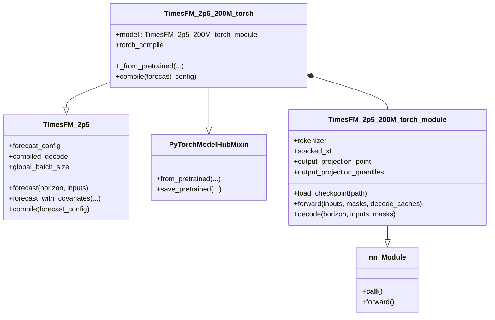
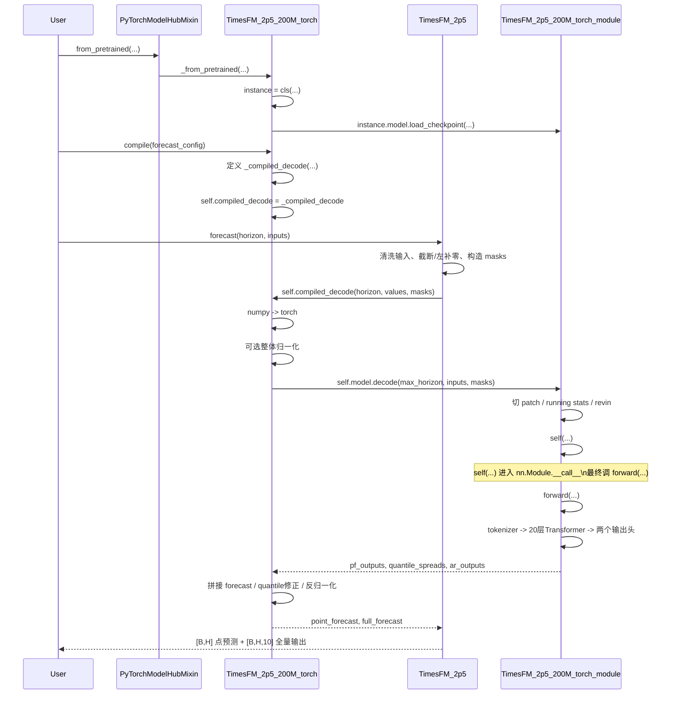

# TimesFM 2.5 代码总览与关键机制简析

本文基于当前仓库里的 **最新 2.5 代码实现**，不是 2024 论文的抽象版本。核心文件是：

- `src/timesfm/timesfm_2p5/timesfm_2p5_base.py`
- `src/timesfm/timesfm_2p5/timesfm_2p5_torch.py`
- `src/timesfm/torch/transformer.py`
- `src/timesfm/utils/xreg_lib.py`

如果只想抓住主线，可以先记住一句话：

> TimesFM 2.5 是一个单变量、patch-based、decoder-only 的时间序列基础模型。输入序列会先被切成长度为 32 的 patch，经 tokenizer 和 20 层 Transformer 建模后，直接输出未来 patch；普通预测默认返回 `q50`，协变量能力通过模型外部的 XReg 线性回归实现。

---

## 1. 当前 2.5 的整体结构

和旧版 `v1/` 不同，当前主线已经切到 `src/timesfm/timesfm_2p5/`。Torch 版本可以分成两层：

- 外层包装器：`TimesFM_2p5_200M_torch`
- 内层模型本体：`TimesFM_2p5_200M_torch_module`

外层负责：

- 从 Hugging Face / 本地目录加载权重
- 保存 `ForecastConfig`
- 在 `compile()` 中生成真实推理入口
- 做后处理，例如 quantile crossing 修复、反归一化、非负约束

内层负责：

- 定义神经网络结构
- 执行 `forward()`
- 执行 `decode()`

核心超参数：

- `input_patch_len = 32`
- `output_patch_len = 128`
- `output_quantile_len = 1024`
- `num_layers = 20`
- `model_dims = 1280`
- `num_heads = 16`
- `quantiles = [0.1, ..., 0.9]`
- `decode_index = 5`

其中：

- `1280 = 128 * 10`
- `10240 = 1024 * 10`
- `10` 个通道表示 `mean + q10~q90`

---

## 2. 类图

这张图的重点是：

- `TimesFM_2p5` 提供统一 `forecast()` / `forecast_with_covariates()` API
- `TimesFM_2p5_200M_torch` 不是网络本体，它只是包装器
- 真正的神经网络在 `self.model`

---

## 3. 调用时序图

当前 2.5 的关键设计不是“子类重写 `_forecast()`”，而是：

- `forecast()` 在基类里已经写好
- 子类 `compile()` 负责构造 `self.compiled_decode`
- 之后统一走 `forecast -> compiled_decode -> model.decode -> model.forward`

---

## 4. 普通预测主链

如果当前任务是“预测一支股票的 `close`”，不带协变量，那么主链可以压缩成下面几步：

1. 输入一条一维 `close` 序列
2. `forecast()` 会截断到 `max_context`，不够就左补零，并生成 `mask`
3. `decode()` 把序列 reshape 成 patch：`[B, C] -> [B, N, 32]`
4. patch 经 tokenizer 投影到 `1280` 维
5. 经过 20 层 Transformer
6. 第一个输出头产生未来 patch 预测
7. 如果 horizon 超过 128，就取 `q50` 做自回归扩展
8. 外层后处理后返回：
   - 点预测：`q50`
   - 全量输出：`mean + q10~q90`

最关键的一点：

- TimesFM 2.5 是 **单变量预测**
- 它并不原生输出 OHLCVA 六维联合结果
- 你现在如果只喂 `close`，它内部就只把它当“一维连续序列”处理

---

## 5. Patch 机制

这是理解 TimesFM 的第一关键点。

模型不是“一个时间点一个 token”，而是：

- 每 `32` 个历史点组成一个输入 patch
- 每个 patch token 直接预测未来 `128` 个点

例如上下文长度 `256`：

- 原始输入：`[B, 256]`
- patch 后：`[B, 8, 32]`

这个设计的意义：

- 比逐点自回归更高效
- 一个 token 就携带局部连续结构
- 一次能直接预测一大段未来

所以它不是 LLM 那种“1 token 预测 1 token”的工作方式，而是：

> 一个 patch 表示去预测一个更长的 future patch

---

## 6. Mask 机制

当前实现里的 `mask` 不是单一用途，而是三层并行工作。

### 6.1 最初的 mask 从哪里来

在 `forecast()` 里：

- 如果输入长度不足 `max_context`
- 就在左边补 0
- 同时生成 `mask`

约定：

- `True` 表示 padding
- `False` 表示真实值

### 6.2 patch 内部怎么用

进入 `decode()` 后：

- `mask` 会 reshape 成 `[B, N_patch, 32]`
- 被 mask 的点会先被置零
- 同时 `mask` 本身会和 patch 值 concat

也就是说，tokenizer 实际吃到的是：

- 32 维 patch 数值
- 32 维 patch mask

拼接后变成：

- `[B, N, 64]`

所以当前实现里，`mask` 并不只是给 attention 用，它会直接作为输入特征参与 tokenizer 投影。

### 6.3 Transformer 里怎么用

传给 Transformer 的不是完整 `[B, N, 32]` mask，而是：

- `masks[..., -1]`

也就是 patch 级别的 mask。它的作用是：

- 修正 RoPE 位置编号
- 构造 causal attention mask
- 屏蔽纯 padding patch

一句话总结：

> point-level mask 负责 patch 内部的无效值处理，patch-level mask 负责时序位置和 attention 屏蔽。

---

## 7. 双输出头

当前 2.5 有两个输出头：

- `output_projection_point`
- `output_projection_quantiles`

它们结构上都只是残差 MLP 头，但语义不同。

### 7.1 第一个头：基础预测头

输出维度是：

- `1280 = 128 * 10`

reshape 后可以理解为：

- `[B, N_patch, 128, 10]`

含义：

- 每个输入 patch 预测未来 128 个点
- 每个点有 10 个通道

这 10 个通道是：

- `mean`
- `q10, q20, ..., q90`

### 7.2 第二个头：连续分位数头

输出维度是：

- `10240 = 1024 * 10`

它主要负责更长 horizon 上的 quantile spread 建模，也就是：

- 不是重新给一份独立点预测
- 而是提供围绕 `q50` 的分布形状信息

### 7.3 为什么叫“双分位数预测头”

更准确地说，不是两个完全独立的 forecast head，而是：

- 第一个头负责“未来值本身”
- 第二个头负责“概率分布形状”

默认点预测返回的是：

- `q50`

不是 `mean`。

---

## 8. 分位数是什么意思

当前输出里的 `q10~q90` 是概率预测，不是 9 个不同模型。

例如：

- `q10 = 100`
  - 可以理解成未来真实值大约有 10% 概率低于 100
- `q50`
  - 是中位数
- `q90`
  - 表示未来真实值大约有 90% 概率低于这个值

所以：

- `q10 ~ q90` 构成一个预测区间
- 区间越宽，不确定性越大
- 默认点预测选 `q50`，因为它通常比 mean 更稳健

---

## 9. XReg 是什么

`xreg` 是 `exogenous regression`，也就是外生变量线性回归。

注意：

- 它**不是** Transformer 内部模块
- 也不是在注意力里直接拼协变量
- 它是包在 TimesFM 外面的一层线性修正器

### 9.1 支持哪些协变量

- `dynamic_numerical_covariates`
- `dynamic_categorical_covariates`
- `static_numerical_covariates`
- `static_categorical_covariates`

### 9.2 两种模式

- `timesfm + xreg`
  - 先用 TimesFM 预测
  - 再用协变量拟合残差

- `xreg + timesfm`
  - 先用协变量拟合 target
  - 再让 TimesFM 去预测剩余残差

### 9.3 它的限制

XReg 需要未来协变量可知，因此更适合：

- 星期几
- 月份
- 节假日
- 已知计划类变量

不适合直接依赖未来未知量，例如：

- 未来真实成交量
- 未来真实 high/low

一句话总结：

> XReg 不是把 covariate 喂进 Transformer，而是在模型外面加了一个线性校正层。

---

## 10. 现在这份代码和旧总结相比，最重要的修正

如果把以前基于论文的概括更新成当前代码版本，最重要的变化有这些：

- 当前主线是 `TimesFM 2.5`，不是 `v1`
- 当前 context limit 是 `16384`，不是旧版常见的 `512`
- tokenizer 输入不是纯 patch 值，而是 `patch value + patch mask`
- 当前显式有两个输出头，不再只是一个简单的 point head
- 默认点预测返回的是 `q50`，不是 mean
- 协变量能力由 XReg 提供，不是直接做多变量 Transformer 输入

---

## 11. 对当前金融场景的直接启示

如果你当前要做“一支股票 `close` 预测”，按当前 2.5 原生逻辑，最适合的理解方式是：

- 把 `close` 当作一维目标序列
- 先直接走 `forecast()`
- 如果要加时间类已知信息，再考虑 `forecast_with_covariates()`
- 不要把它误解为原生支持 OHLCVA 六维联合建模

更实际的落地方向通常是：

- 第一阶段：只预测 `close` 或 `log return`
- 第二阶段：再决定是否做多目标外部组装

---

## 12. 一句话收束

TimesFM 2.5 当前代码的本质可以概括成：

> 单变量 patch-based Transformer 主干 + 双输出头概率预测 + 模型外 XReg 协变量修正。

如果要继续深挖源码，推荐优先阅读顺序：

1. `timesfm_2p5_base.py`
2. `timesfm_2p5_torch.py`
3. `transformer.py`
4. `xreg_lib.py`

